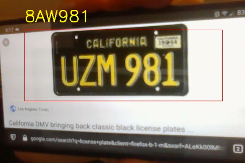
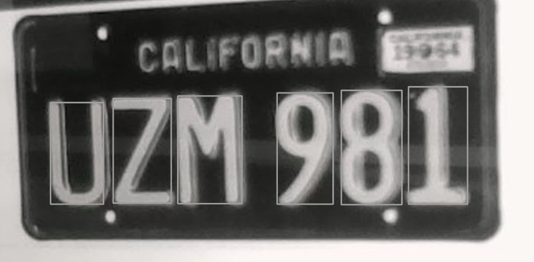
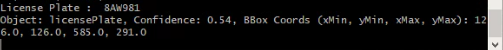
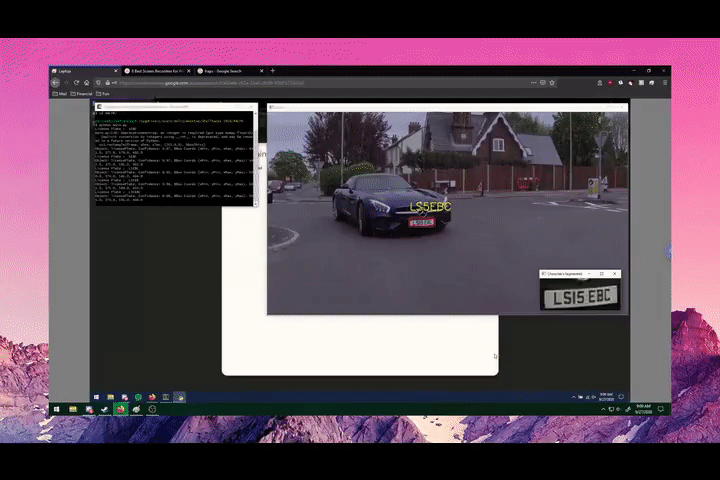
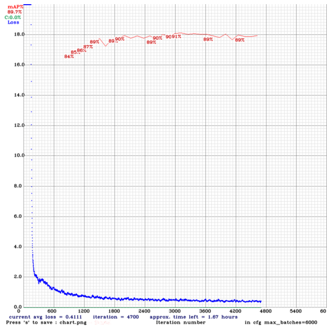

# ANLPR
Artifical Nerual Netowrk License Plate Recognition

[](LICENSE)

## Getting Started
### Conda (Recommended)

```bash
# Tensorflow CPU
conda env create -f conda_cpu.yml
conda activate ANLPR-cpu

# Tensorflow GPU
conda env create -f conda_gpu.yml
conda activate ANLPR-gpu
```

### Pip
```bash
# TensorFlow CPU
pip install -r requirements_CPU.txt

# TensorFlow GPU
pip install -r requirements_GPU.txt
```

### Nvidia Driver (For a discrete GPU if the Conda Environment is not used and CUDA is not setup)
Try to use CUDA Toolkit version 10.1 because it is compatible for the version of TensorFlow used in this repository.
https://developer.nvidia.com/cuda-10.1-download-archive-update2

## Downloading Pre-trained Weights
ANLPR comes pre-trained. For easy demo purposes we will use the pre-trained weights.
Download pre-trained ANLPR weights zip file: https://drive.google.com/file/d/1FJC1wQ0KKbc7EgVjL0mOMRQgmaroOipK/view?usp=sharing

Extract the contents of the zip file to where main.py is located.


### Result Image(s) (TensorFlow)
You can find the outputted image(s) showing the detections every 125 frames saved in the detections folder.
#### Pre-trained ANLPR Model Example
<p align="center"></p>
<p align="center"></p>
<p align="center"></p>


### Result Video
The nerual network is run on live video, it can be exported wherever you want with minimal changes. 
<p align="center"></p>


### Print Detailed Info on Each Detection (confidence, bounding box coordinates)
Every frame the network detects a license plate, the program prints information over confidence in the detection, as well as the bounding box coordinates.

## Plate Recognition Using Tesseract OCR
We established a set of preprocessing rules over size, aspect ratio, height, and width of bounding box regions to ensure only plate numbers were sent to Tesseract OCR.
The preprocessing and text-extraction is all done under the <strong>getPlateNumber</strong> function, found in the file [util.py](https://github.com/20af02/ANLPR/blob/master/util.py)

<strong>Note: To run tesseract OCR, appropriate bianary files must be downloaded, setup, and properly imported. 
The string 'pytesseract.pytesseract.tesseract_cmd' must point to a proper tesseract OCR executable.</strong>

Tesseract OCR Github Repo: [tesseract-ocr/tessdoc](https://github.com/tesseract-ocr/tessdoc)

### Developer Notes
All Nerual Networks were trained using Google's Open Images Dataset.
<p align="center"></p>

You can see a demo here: youtube.com 

# Sample pipeline

To get started, connect a camera to your computer, then run the `main.py` file to start image processing. You can view the predicted license plate text directly on live video feed. 

If you want to generate a different neural network (Artificial, reccurrent, etc) for ANLPR, you can use Google's Open Images Dataset to train one in Tensor Flow then import it. 

ANLPR is Open Source. You can find the code on the [GitHub repo](https://github.com/20af02/ANLPR).
